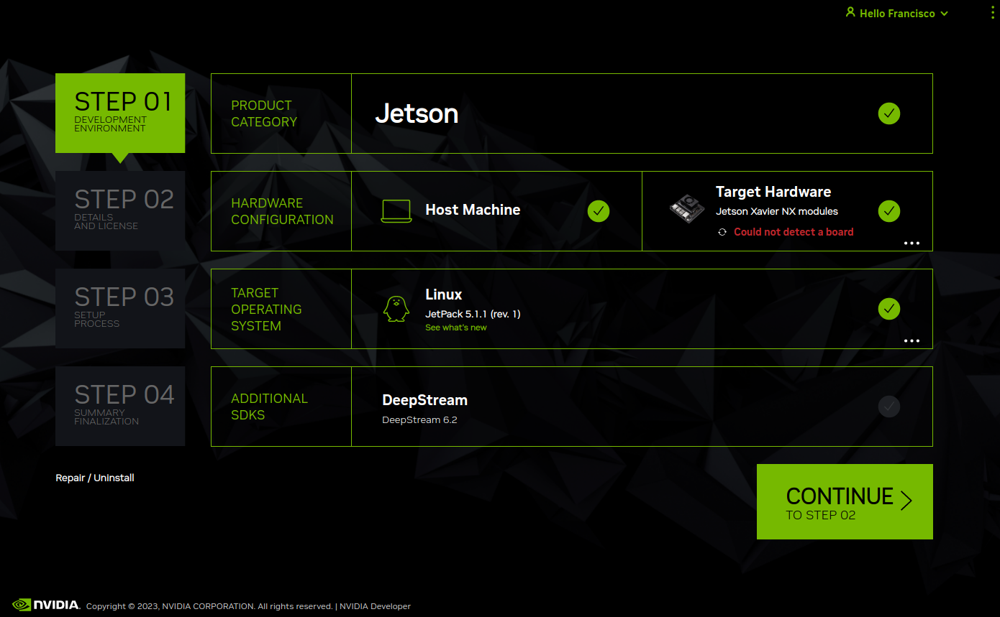
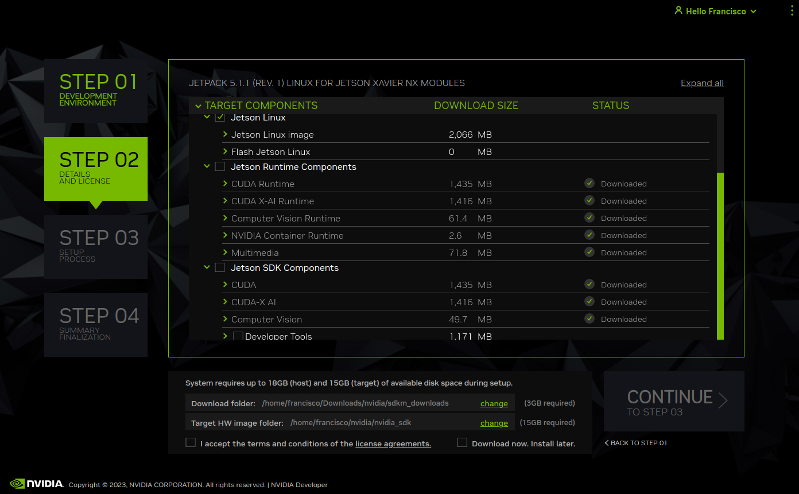

---
hide:
  - footer
---

# OS and ROS Installation

At the date of writing the most recent version of the **JetPack** software suppoted by the **NVIDIA Jetson Xavier NX** module and the **Connect Tech Photon** carrier board is version *5.1.1*. The following steps describe how to install this **JetPack** version on the onboard computer.  

## 1. SDK Manager

The installation of the operating system must be made using the [**NVIDIA SDK Manager**](https://docs.nvidia.com/sdk-manager/index.html) running on a computer with *Ubuntu 18.04* or *Ubuntu 20.04*. For reference, the installation was made using a machine with *Ubuntu 18.04* and the SDK Manager version *1.9.1.10899*.

## 2. Board Support Package Installation

The carrier board manufactor provides a Board Support Package (BSP) that ensures the correct functioning of the OS with the carrier board. To do this, clear instructions are provided [here](https://connecttech.com/resource-center/kdb373/). During this process, the **Jetson Xavier NX modules** was selected as the target hardware and the *JetPack 5.1.1 (rev. 1)* was selected as the target OS. Additionally, the BSP version *NX L4T r35.3.1 BSP* was downloaded from the manufactor [resource center](https://connecttech.com/resource-center/l4t-board-support-packages/). Given that the SDK Manager version used in the guide is outdated, the images below show the board, OS and target components selection.




In step 11 of the guide, the following steps were taken to connect the onboard computer to the machine running the SDK Manager:

1.  Connect the Power Cable of the +12V Power Supply into the Barrel Jack;
2.  Plug the AC cable on the +12V Power Supply into the wall socket;
3.  Press the switch *SW2* during 10 seconds to enter forced recovery mode;
4.  Press the switch *SW2* once to reset the board;
5.  Plug in a USB-A to micro USB-B cable from the host machine to the OTG USB port located below the ethernet port on the carrier board;
6.  Verify the board is connected by running the `lsusb` on the host machine.

## 3. First Boot

After the OS installation, the first boot must be made by connecting a monitor and peripherals to the board so as to complete the initial setup and create a user. SSH is not available before creating a user and accepting the license terms. For reference, the username "jetson" was created.

## 4. Booting from the NVMe SSD

Now that the OS is installed and working the, the NVMe SSD can be configured as the boot device. To do this it is first necessary to move the root filesystem to the drive. The following steps are according to the [rootOnNVMe](https://github.com/jetsonhacks/rootOnNVMe) repository.

```bash
git clone https://github.com/jetsonhacks/rootOnNVMe
cd rootOnNVMe
./copy-rootfs-ssd.sh
./setup-service.sh
sudo reboot now
```

## 5. Installing JetPack SDK Components

Finally, it is possible to install several JetPack SDK Compnents. The are useful for instance for running conatiners using Docker. To do this, [this guide](https://connecttech.com/resource-center/kdb374/) from the carrier board manufactor was followed.

Additionally, after the installation of all the selected componets, docker was configured to run wihtout root previleges using the command `sudo usermod -aG docker $USER`, after which it is required to log out and log back in.

## 6. Installing ROS

The version of the installed OS is based on *Ubuntu 20.04* for which the latest version of ROS1 is *ROS Noetic*. To install it, the official guide in the [ROS wiki](http://wiki.ros.org/noetic/Installation/Ubuntu) was followed.


1.  Setup sources.list
    ```bash
    sudo sh -c 'echo "deb http://packages.ros.org/ros/ubuntu $(lsb_release -sc) main" > /etc/apt/sources.list.d/ros-latest.list'
    ```

2.  Setup keys
    ```bash
    sudo apt install curl
    curl -s https://raw.githubusercontent.com/ros/rosdistro/master/ros.asc | sudo apt-key add -
    sudo apt update
    ```

3.  Installation (the desktop-full variant was selected for this specific installation)
    ```bash
    sudo apt install ros-noetic-desktop-full
    ```

4.  Environment setup
    ```bash
    echo "source /opt/ros/noetic/setup.bash" >> ~/.bashrc
    source ~/.bashrc
    ```

5.  Dependencies for building packages
    ```bash
    sudo apt install python3-rosdep python3-rosinstall python3-rosinstall-generator python3-wstool build-essential

    sudo rosdep init
    rosdep update
    ```