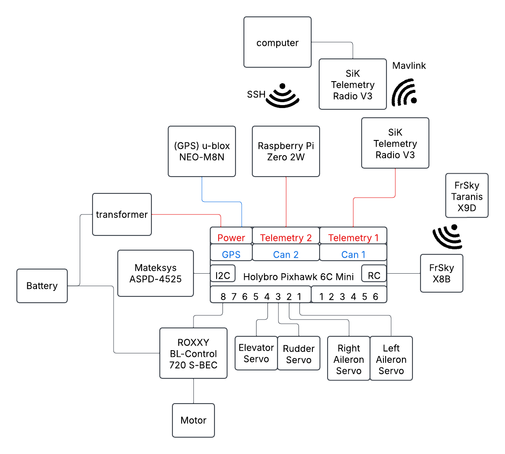

## Hardware Components

The fixed-wing drone selected for this study is the **EasyGlider 4**, chosen for its stability and suitability for autonomous flight.  
The following hardware components were integrated into the system:

*Figure: Electrical diagram of connections and communication*

- **Main Flight Controller:** Holybro Pixhawk 6C Mini  
- **Companion Computer:** Raspberry Pi Zero 2W  
- **Global Positioning System (GPS):** u-blox NEO-M8N  
- **Wireless Communication via MAVLink:** SiK Telemetry Radio V3  
- **Wireless Communication via WiFi:** External Raspberry Pi Antenna  
- **Radio Control (RC) System:**
  - **RC Receiver:** FrSky X8B  
  - **RC Transmitter:** FrSky Taranis X9D  
- **Battery:** Soaring 2200mAh 11.1V 3S1P 30C  
- **Airspeed Sensor:** Mateksys ASPD-4525  
- **Electronic Speed Controller (ESC):** ROXXY BL-Control 720 S-BEC  
- **Servos:** Four Hitec HS-81 servos, one per control surface  

These components were selected to ensure reliable flight control, communication, and sensor data acquisition for autonomous navigation.  
Their connections and communication layout are shown in the figure above.  
The Raspberry Pi was modified to include an external WiFi antenna, located on the right wing, to increase the range and bitrate of communication.  
This modification required micro soldering of an IPEX IPX UFL connector to the Raspberry Pi.